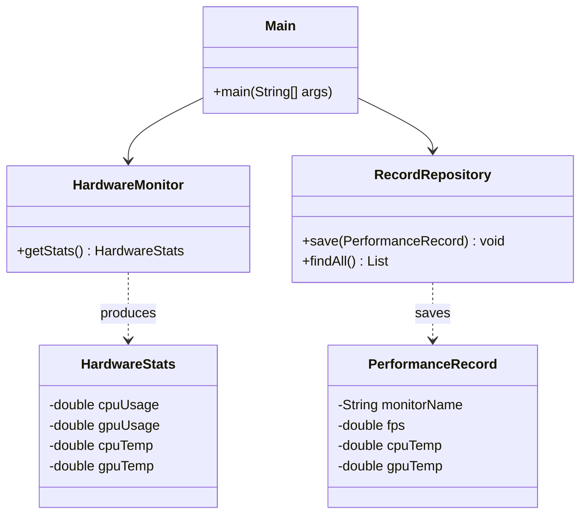

🖥️ PC 效能即時監控系統 (Hardware Performance Monitor)
針對高階 PC 硬體設計的監控系統，支持 Intel 第 14 代 CPU 架構與 RTX 50 系列 顯卡，實現 240 FPS 環境下的穩定數據紀錄。

## 🏗️ 專案架構

```
pc-monitor/
├── src/main/java/com/pc/monitor/
│   ├── Main.java                ← 程式入口（監控迴圈主體）
│   ├── config/
│   │   └── DBUtil.java          ← PostgreSQL JDBC 連線設定
│   ├── hardware/
│   │   └── HardwareMonitor.java ← 核心：OSHI 與 JSensors 混合驅動
│   ├── model/
│   │   ├── HardwareStats.java   ← 原始硬體數據物件
│   │   └── PerformanceRecord.java ← 整合後的效能紀錄物件
│   ├── dao/
│   │   └── RecordRepository.java ← 效能紀錄 CRUD (Insert/FindAll)
│   └── view/
│       └── MonitorView.java     ← 控制台即時輸出顯示
├── sql/
│   └── schema.sql               ← PostgreSQL 建表與索引優化
├── run.bat                      ← Windows 一鍵管理員權限執行
└── pom.xml                      ← Maven 依賴 (OSHI, JSensors, Postgres)
```

## 🚀 如何使用

### 1. 建立資料庫

```bash
-- 使用 DataGrip 或 psql 執行 sql/schema.sql
CREATE TABLE performance_records (
    id SERIAL PRIMARY KEY,
    monitor_name VARCHAR(100),
    fps DOUBLE PRECISION,
    cpu_temp DOUBLE PRECISION,
    gpu_temp DOUBLE PRECISION,
    cpu_usage DOUBLE PRECISION,
    gpu_usage DOUBLE PRECISION,
    created_at TIMESTAMP WITH TIME ZONE DEFAULT CURRENT_TIMESTAMP
);
```


### 2. 編譯 & 執行

```Bash
mvn clean package
java -jar target/pc-monitor-1.0.jar
```

### 3. 環境要求
Java: JDK 17+

權限: 必須以 系統管理員身分 執行 IDE 或 Java 程式（否則無法讀取 CPU 溫度）。

硬體: 支援 Intel Hybrid 架構 (P-Core/E-Core)。

## 📐 架構說明

```
Hardware(PC) → HardwareMonitor(OSHI/JSensors) → RecordRepository(JDBC) → PostgreSQL
      ↑ 讀取感測器               ↑ 數據封裝                      ↑ SQL 寫入
```

### 各層職責

| 層 | 職責 | 可以做 | 不能做 |
|----|------|--------|--------|
| **Hardware** | 獲取硬體底層數據 |OSHI (CPU 使用率/溫度), JSensors (GPU 數據) |
| **DAO** | 資料持久化 | JDBC / PreparedStatement |
| **Model** | 資料載體 | POJO (儲存溫度、負載、FPS) |
| **View** | 監控介面 | CLI Console (控制台格式化輸出) |

## 📊 類別圖（Mermaid）



## 📊 ERD（Mermaid）

```mermaid
erDiagram
    performance_records {
        int id PK
        string monitor_name
        double fps
        double cpu_temp
        double gpu_temp
        double cpu_usage
        double gpu_usage
        timestamp created_at
    }
    }
```

---

