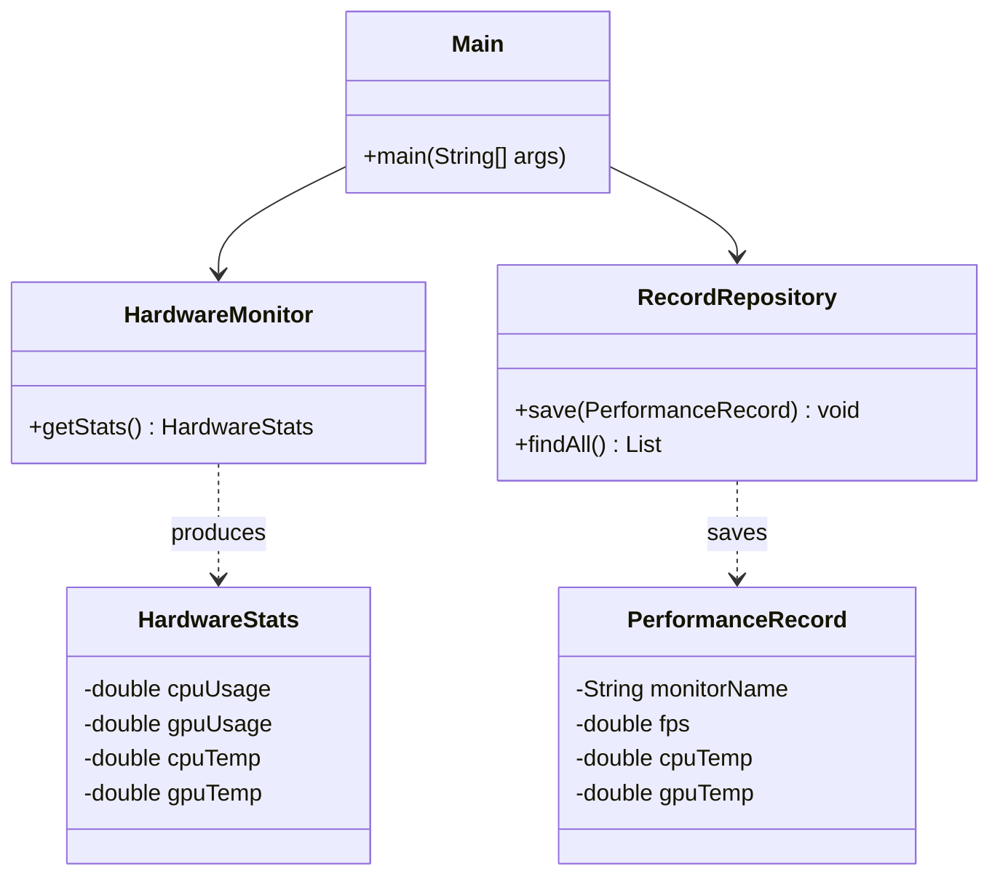
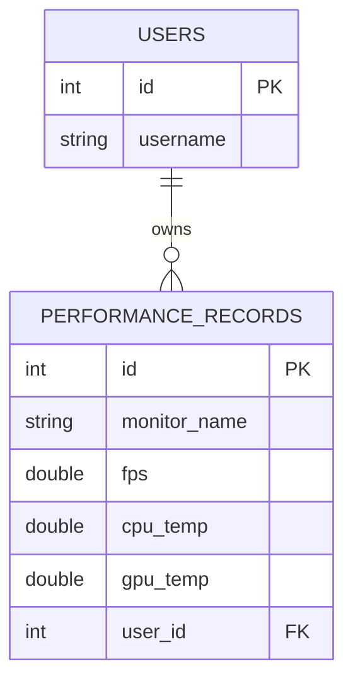

🖥️ PC 效能即時監控系統 (Hardware Performance Monitor)
PC 硬體設計的監控系統。

## 🏗️ 專案架構

```
pc-monitor/
├── src/main/java/template/
│   ├── Main.java                ← 程式入口（處理使用者 ID 輸入與監控迴圈）
│   ├── config/
│   │   └── DBUtil.java          ← PostgreSQL JDBC 連線設定
│   ├── hardware/
│   │   └── HardwareMonitor.java ← 核心：OSHI 與 JSensors 混合驅動（已修正遞迴錯誤）
│   ├── model/
│   │   ├── HardwareStats.java   ← 原始硬體感測器數據物件[cite: 4]
│   │   └── PerformanceRecord.java ← 整合後的效能紀錄物件（支援 monitorName）[cite: 7]
│   ├── Repository/
│   │   └── RecordDao.java       ← 效能紀錄 CRUD (支援 user_id 關聯)
│   ├── service/
│   │   └── ComparisonService.java ← 帳號數據對比邏輯（分析 FPS 與溫差）
│   └── view/
│       └── MonitorView.java     ← 控制台即時輸出與功能選單顯示
├── run.bat                      ← Windows 一鍵管理員權限執行
└── pom.xml                      ← Maven 依賴 (OSHI, JSensors, Postgres)
```

## 🚀 如何使用

### 1. 建立資料庫

```bash
-- -- 建立使用者表
CREATE TABLE users (
    id SERIAL PRIMARY KEY,
    username VARCHAR(50) UNIQUE NOT NULL,
    password_hash VARCHAR(100) NOT NULL
);

-- 建立效能紀錄表 (與 users 關聯)
CREATE TABLE performance_records (
    id SERIAL PRIMARY KEY,
    monitor_name VARCHAR(100),
    fps DOUBLE PRECISION,
    cpu_temp DOUBLE PRECISION,
    gpu_temp DOUBLE PRECISION,
    cpu_usage DOUBLE PRECISION,
    gpu_usage DOUBLE PRECISION,
    user_id INTEGER REFERENCES users(id), -- 外鍵關聯
    created_at TIMESTAMP WITH TIME ZONE DEFAULT CURRENT_TIMESTAMP
);

-- 插入測試帳號以供對比
INSERT INTO users (username, password_hash) VALUES ('admin', 'admin123'), ('guest', 'guest123');
```


### 2. 編譯 & 執行

(1) 設定連線：請確保 DBUtil.java 中的資料庫密碼正確。
(2) 啟動程式：
```Bash
mvn clean package
java -jar target/pc-monitor-1.0.jar
```
(3) 操作流程：

程式啟動後，請輸入您的 使用者 ID (例如 1 代表 Player_A)。  

系統會執行硬體診斷並開始每 5 秒一次的自動存檔。


### 3. 環境要求
Java: JDK 17+

權限: 必須以 系統管理員身分 執行，否則感測器讀數可能為 0[cite: 5]。

資料庫: PostgreSQL 13+[cite: 2]。

## 📐 架構說明

```
Hardware(PC) → HardwareMonitor(OSHI/JSensors) → RecordRepository(JDBC) → PostgreSQL
      ↑ 讀取感測器               ↑ 數據封裝                      ↑ SQL 寫入
```

### 各層職責

| 層 | 職責 | 可以做 | 不能做 |
|----|------|--------|--------|
| **Hardware** | 獲取硬體底層數據 |OSHI (CPU 使用率/溫度), JSensors (GPU 數據) |
| **DAO** | 資料持久化與關聯查詢[cite: 8] |根據 user_id 儲存數據或抓取最新一筆紀錄[cite: 8] |
| **Model** | 資料載體 | POJO (儲存溫度、負載、FPS) |
| **Service** | 業務邏輯處理 | 對比兩個不同帳號間的效能差異（FPS/溫差）[cite: 1]|
| **View** | 監控介面 | 提供選單與 \r 即時更新的控制台界面[cite: 6] |

## 📊 類別圖（Mermaid）



## 📊 ERD（Mermaid）



---

